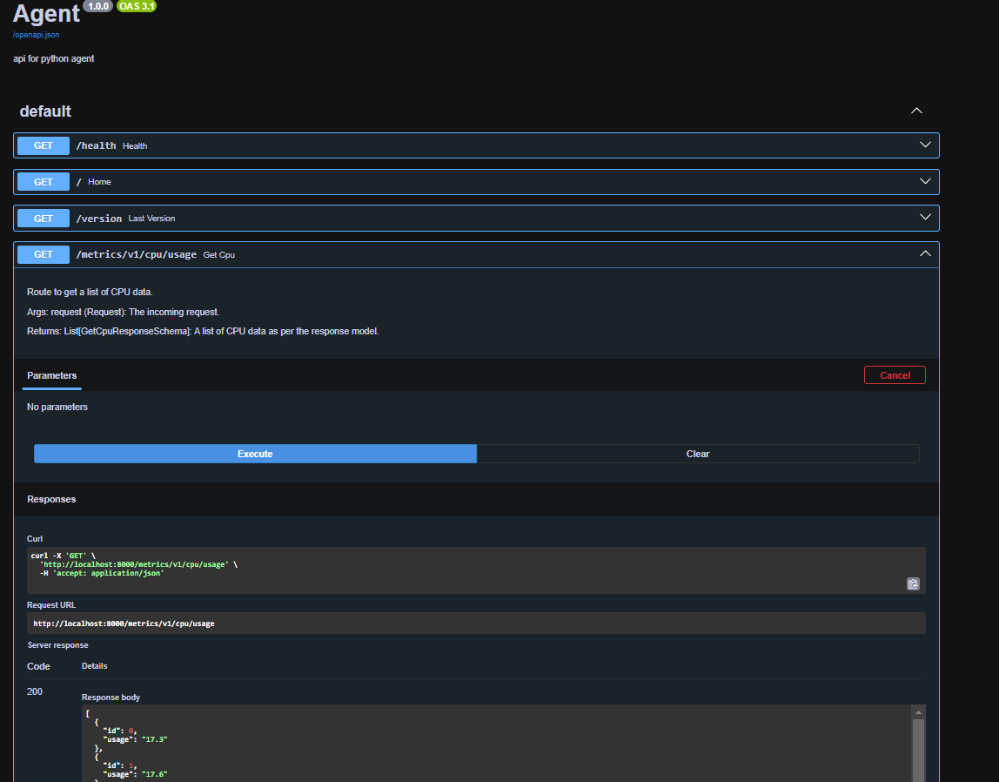

# Monitoring Agent

# Project Status


[](https://devops.telecomste.fr/printerfaceadmin/2024-25/group1/printerface/-/pipelines)
[](https://devops.telecomste.fr/printerfaceadmin/2024-25/group1/printerface/-/graphs/main)


## Description

A robust Server Monitoring Agent that provides real-time system metrics collection and monitoring through SSH connections. The agent collects CPU, RAM, disk usage, and log data from remote machines and exposes this information via a REST API.

## Features

- **System Metrics**
  - CPU usage tracking
  - RAM utilization
  - Disk space monitoring
  - Log file analysis

- **API Integration**
  - RESTful endpoints
  - Swagger/OpenAPI documentation
  - Real-time data access

- **Deployment**
  - Docker containerization
  - Continuous Integration/Deployment
  - Volume mounting for logs

## Screenshots

Api Real-time system metrics retreival

## How to Use

### API Documentation

The API documentation is available in two formats:
- Swagger UI: `http://localhost:8000/docs`
- ReDoc: `http://localhost:8000/redoc`

### Available Endpoints Example

* metrics/v1/cpu/usage
* metrics/v1/disk/usage
* metrics/v1/log/logs

so to get information for each server we need base url (ip address or domain) then the endpoint to access.

## Technical Requirements

- Python 3.12+
- Docker
- SSH access to target machines and run the docker container in them.


## Usage

Run project with `make debug` and consult url in log for api doc at `/docs` or `/redoc`.

Application is running 2 threads, one for the API to expose metrics and one for collecting metrics.

## Installation

To install the project on your machine, follow the steps : 

### 1. Clone the project

Open a terminal and use the following command : 
```sh
git clone https://devops.telecomste.fr/printerfaceadmin/2024-25/group1/printerface.git 
```

### To run project locally

#### Install virtual environment and dependencies

To be able to run the project, you will need a python virtual environment and some libraries used in the project. <br><br>

##### a) Virtual Environment & Dependencies
All of the dependencies used in the project have been written in a file name `requirements.txt`. and can be installed also using this command that creates a virtual python environment as well.
```sh
make environment
```

#### b) Run project

Once you've done that, run the command : 
```sh
make run
```
* by default the log path is set to /var/log/apache2/access.log but it can be changed using --log-path, an example to run is the following: 

```sh
python3  src/main.py --log-path /src/logs/wordpress.log
```

## Using Docker

### Pull and Run the Project using Docker

To pull the latest Docker image and run the project, use the following commands:

```sh
docker pull devops.telecomste.fr:5050/printerfaceadmin/2024-25/group1/printerface:latest
```

You can run the project only using Docker. Open a terminal and run the command : 

```sh
docker run -d --name printerface-container -p 80:8000 /var/logs:/app/log --log-path /app/log/access.log
```
Explanation on the command : 

* `printerface` : Name of the docker container
* `80` : server port
* `8000` : docker container port
* `/var/logs` : path to logs on the server
* `/app/logs` : path to logs on the docker container
* --log-path is an option to specify where do the logs are to be accessed by the python script.


## Contributing

- Fork the repository
- Create feature branch (git checkout -b feature/AmazingFeature)
- Commit changes (git commit -m 'Add AmazingFeature')
- Push to branch (git push origin feature/AmazingFeature)
- Open a Pull Request